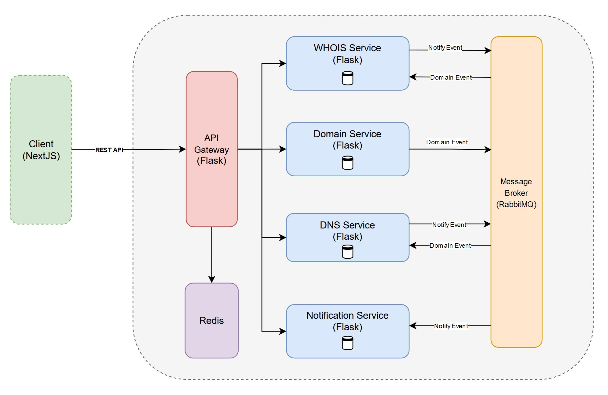

# Domain Monitor Service

A comprehensive service for tracking and managing DNS records and WHOIS information across multiple domains, providing real-time monitoring, historical data tracking, and domain validation.

## Table of Contents
- [Overview](#overview)
- [Features](#features)
- [Architecture](#architecture)
  - [Technologies Used](#technologies-used)
- [Getting Started](#getting-started)
  - [Prerequisites](#prerequisites)
  - [Installation](#installation)
- [Configuration](#configuration)
- [API Documentation](#api-documentation)
- [FrontEnd](#frontend)

## Overview

Domain Monitor offers an easy-to-use platform for managing domain entries, monitoring DNS records and WHOIS information, and accessing historical changes. In addition you are able to receive alerts via our notification service. It's designed for system administrators, network engineers, and anyone needing to keep track of domain-related changes across multiple domains.

## Features

- Add, validate, and manage domains for monitoring
- Retrieve current DNS records and WHOIS information for monitored domains
- Access historical DNS and WHOIS changes (we check for updates every 30 minutes!)
- Real-time updates via message queue system
- RESTful API with versioning
- Pagination support for efficient data retrieval
- Domain statistics and change tracking
- Notification system for domain changes (ability to subscribe / unsubscribe)

## Architecture

The system is built using a microservices architecture:

1. API Gateway: Entry point for other microservices, protected with rate limiting
2. Domain Service: Manages domain entries, validates domains, and initiates monitoring
3. DNS Service: Tracks and provides current and historical DNS records
4. WHOIS Service: Tracks and provides current and historical WHOIS information
5. Notification Service: Ability to subscribe to notificaitons for specific domains
6. Frontend Service: Provides user interface for interacting with the system
7. PostgreSQL Database: Stores domain, DNS record, and WHOIS data
8. RabbitMQ Message Broker: Handles inter-service communication using queues (fanout and direct exchanges)
9. Redis: For cachins and utilized by Rate Limiter in the API Gateway

### Technologies Used

- Python 3.9+
- Flask: Framework for building the APIs
- Next.js: Frontend framework for the user interface
- Redis: For caching
- SQLAlchemy: ORM for database interactions
- PostgreSQL: Database for storing domain, DNS, Notifcations, and WHOIS data
- RabbitMQ: Message queue for inter-service communication
- Docker & Docker Compose: Containerization and orchestration
- React Query: Data fetching, caching, and state management in the frontend
- Tailwind CSS: Frontend Styling

## Getting Started

### Prerequisites

- Docker Deskstop
- Python 3.9+
- Node.js

### Installation

1. Clone the repository:

2. Navigate to the project directory:
   cd domain-monitor

3. Build and start the services (due to RabbitMQ initialization, bootup may take up to 30 seconds):
   docker compose up --build

4. Navigate to http://localhost:3010

## Configuration

Environment variables can be set in the `docker-compose.yml` file or in a `.env` file in the project root.

Key variables:
- `DATABASE_URL`: PostgreSQL connection string
- `RABBITMQ_HOST`: RabbitMQ server address
- `SECRET_KEY`: Secret key for Flask applications

## API Documentation

For detailed API documentation, please refer to the following README files:

- [Domain Service README](./backend/domain-service/README.md)
- [DNS Service README](./backend/dns-service/README.md)
- [WHOIS Service README](./backend/whois-service/README.md)
- [Notification Service README](./backend/notification-service/README.md)

## Frontend

The frontend provides a user-friendly interface for interacting with the Domain Monitor Service. Key features include:

- Domain search and validation
- Homepage with recently updated domains, with pagination
- Comprehensive domain profiles with DNS and WHOIS information
- Historical data visualization
- Notification subscription for domain changes

For more details, see the [Frontend README](./frontend/README.md).